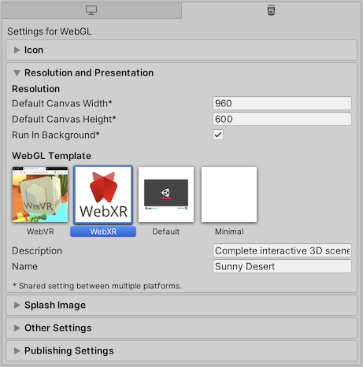
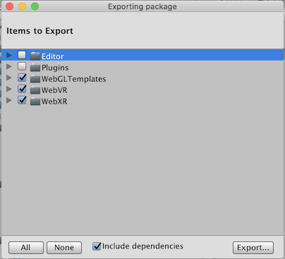

# Building the Sample

If you are a maintainer of this project, and you modified the demo scene distributed with the package, you will want to update the [`Build/` directory](https://github.com/mozilla/unity-webvr-export/tree/master/Build/) (hosted [online here](https://mozilla.github.io/unity-webvr-export/Build/)).

1. Launch `Edit > Build Settings > Project Settings`. From `Player Settings…` (`Edit > Project Settings > Player`), select the **`WebGL settings`** tab (HTML5 icon), toggle the **`Resolution and Presentation`** view, and select **`WebXR`** for the `WebGL Template`.

    

2. Launch `Edit > Build Settings > Project Settings`. Then, press the **`Build and Run`** button, and **`Save`** to the directory named **`Build`**.

    

# Building the Unity Package

If you are contributing to the Assets, you can build and export a new version of the [`WebXR-Exporter.unitypackage` file](../WebXR-Exporter.unitypackage).

Notice that the package does not include all the assets in the repository but **only those under `WebXR`, and `WebGLTemplates/WebXR`**:

1. Open **`Assets > Export Package…`**. A window titled `Exporting package` will appear. Press the **`Export…`** button to proceed.

    

2. When prompted for the file location, set **`WebXR-Exporter`** as the filename of the destination Unity Asset Package, and press the **`Save`** button.

    

# One click builds

Both of the above products can be built via menu or command line. The project includes a C# script at `Assets/Editr/Builder.cs` with methods for building. It presents a `Build` menu in the editor which you can use to build the products above in one click.

You can invoke the methods in the script from the command line by using `-executeMethod` parameter as documented at https://docs.unity3d.com/Manual/CommandLineArguments.html

| Product | Command |
| --- | --- |
| Package | `<path-to-editor> -projectPath <path-to-project> -batchMode -executeMethod WebXR.Editor.Builder.BuildPackage -quit`
| Desert Sample | `<path-to-editor> -projectPath <path-to-project> -batchMode -executeMethod WebXR.Editor.Builder.BuildDesertSample -quit`
| Package and Sample | `<path-to-editor> -projectPath <path-to-project> -batchMode -executeMethod WebXR.Editor.Builder.BuildAll -quit`